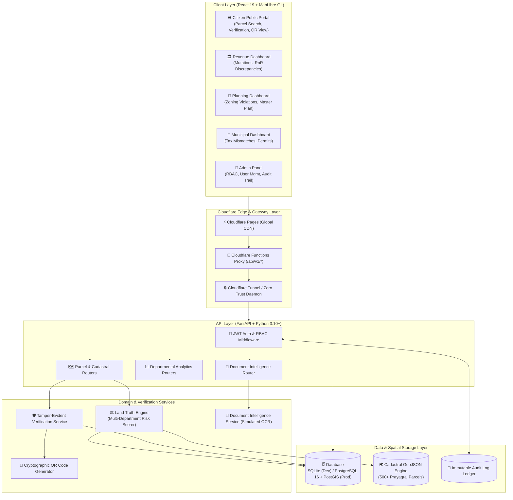
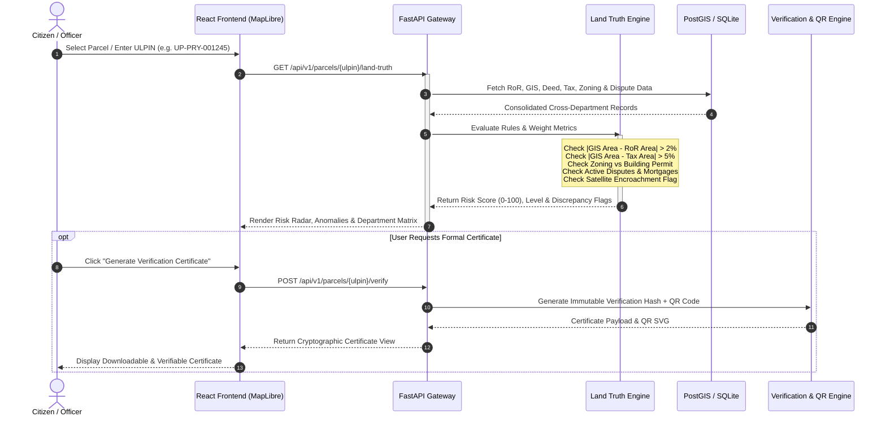

# 🌐 BhoomiStack

> **Integrated GIS-Based Digital Public Infrastructure (DPI) for Land Governance**  
> *"One Parcel. One Identity. Every Land Record Connected."*

[](https://fastapi.tiangolo.com)
[](https://react.dev)
[](https://www.typescriptlang.org)
[](https://vitejs.dev)
[](https://maplibre.org)
[](https://postgis.net)
[](https://pages.cloudflare.com)
[](LICENSE)

---

## 📌 Executive Summary

India's land governance suffers from **record fragmentation**. A single parcel of land has its lifecycle data scattered across isolated departmental silos:
* **Revenue Department** (RoR / Record of Rights / खसरा / खतौनी)
* **Registration & Stamps Department** (Sale deeds, mortgages, encumbrances)
* **Urban Development & Master Planning** (Zoning codes, land-use master plans)
* **Municipal Corporations** (Building permits, property tax assessments)
* **Utility Boards** (Water, electricity, sewage, gas connections)

These disconnected databases prevent cross-validation, enable forged registrations, cause multi-year court litigations, and force citizens to visit multiple government offices for routine verifications.

**BhoomiStack** is an interoperability Digital Public Infrastructure (DPI) layer built on the **ULPIN (Unique Land Parcel Identification Number)**. It does not replace legacy departmental databases; instead, it establishes an automated verification and audit fabric connecting every record to a standardized spatial polygon.

---

## 🏗️ System Architecture



---

## 🔄 Land Truth Verification Flow



---

## ⚡ Core Capabilities

### 1. Interactive Cadastral GIS Engine
* **500+ Cadastral Polygons**: Centered around Prayagraj district (Civil Lines, Naini, Phaphamau, Jhunsi, Subedarganj).
* **Live Heatmaps & Thematic Filtering**: Color-coded by risk level (Green = Verified, Amber = Attention Required, Red = High Conflict / Fraud Risk, Blue = State / Government Land).
* **Multi-Layer Controls**: Cadastral boundaries, satellite imagery basemap, master plan zoning overlays, utility grids, and risk heatmaps.

### 2. Single-Pane Parcel Dossier (9-Tab Inspector)
Every parcel acts as an aggregated dossier indexed by ULPIN:
1. **Overview**: Key metrics, spatial dimensions, village/tehsil, and composite health score.
2. **Ownership (RoR)**: Title records, historical mutation chains, co-sharer fractions.
3. **Registration (Deeds)**: Registered deeds, transaction history, stamp duty values.
4. **Planning & Zoning**: Master plan designation, permissible land use, zoning restrictions.
5. **Building Permissions**: Approved floor plans, built-up areas, architectural clearances.
6. **Property Tax**: Municipal assessment year, taxed square footage, payment history.
7. **Utilities**: Water, electricity (UPPCL), gas (IGL), and sewage connection IDs.
8. **Document Intelligence**: Uploaded mutation orders, registry copies, and OCR field verification.
9. **Audit Trail**: Immutable actor log tracking who viewed or altered records.

### 3. The Land Truth Engine
Automated rule-based reconciliation comparing spatial ground-truth against departmental claims:
* **Area Inconsistency Detection**: Flags discrepancies between GIS polygon geometry, RoR recorded area, registered deed area, and municipal tax area.
* **Zoning Conflict Detection**: Flags instances where commercial buildings are sanctioned on agricultural or low-density residential zones.
* **Encumbrance & Dispute Detection**: Cross-references active bank mortgages (e.g., SBI, PNB) and pending suits in Revenue and Civil Courts.
* **Risk Score Index (0–100)**: Translates multi-factor anomalies into actionable risk categories: `LOW` (0–30), `MEDIUM` (31–60), and `HIGH` (61–100).

### 4. Tamper-Evident Verification & QR Certificates
* **10-Point Step-by-Step Verification Protocol**: Automated background checks across title ownership, pending disputes, tax clearance, encumbrances, and boundary alignment.
* **Cryptographic QR Certificate**: Emits a public verification certificate with a unique SHA verification token, enabling banks, buyers, and registrars to scan and verify validity in real time.

### 5. Multi-Role Government Officer Dashboards
* **Revenue Officer Dashboard**: Prioritizes boundary mismatches, high-velocity transactions, and pending mutations.
* **Planning Officer Dashboard**: Flags unauthorized structural expansions and zoning violations.
* **Municipal Officer Dashboard**: Detects property tax evasion where built area exceeds taxed area.
* **Admin Panel**: Role-based access control (RBAC), user session tracking, and full system configuration.

---

## 🛠️ Technology Stack

| Layer | Technologies | Description |
|---|---|---|
| **Frontend** | React 19, TypeScript, Vite 8, Tailwind CSS | High-performance SPA with strict typing and responsive UI |
| **Mapping Engine** | MapLibre GL JS 6, GeoJSON | Hardware-accelerated vector and raster cadastral rendering |
| **State & Charts** | Zustand 5, Recharts 3, Lucide React | Global state stores and rich data visualizations |
| **Backend API** | FastAPI 0.111, Uvicorn, Pydantic v2 | High-speed asynchronous REST API with auto OpenAPI docs |
| **Database & ORM** | SQLAlchemy 2.0, GeoAlchemy2, Shapely | Database abstraction supporting SQLite and PostgreSQL/PostGIS |
| **Security & Auth** | Python-Jose, Passlib (bcrypt), RBAC | JWT access tokens with granular role-based permissions |
| **Edge & CDN** | Cloudflare Pages, Edge Functions Proxy | Zero-latency static hosting, proxy routing, and HTTPS security |
| **Containerization** | Docker, Docker Compose | Reproducible production and development container setups |

---

## 📁 Repository Structure

```text
BhoomiStack/
├── backend/                        # FastAPI Python backend
│   ├── app/
│   │   ├── auth/                   # JWT generation, hashing & RBAC logic
│   │   │   ├── jwt.py
│   │   │   └── rbac.py
│   │   ├── routers/                # Modular API route controllers
│   │   │   ├── auth.py             # Login & token endpoints
│   │   │   ├── parcels.py          # Parcel CRUD, search, GIS & land-truth
│   │   │   ├── dashboard.py        # Departmental KPI aggregations
│   │   │   └── misc.py             # Health check & system status
│   │   ├── services/               # Core business & computation logic
│   │   │   ├── land_truth_engine.py# Cross-department risk scoring engine
│   │   │   ├── verification_service.py # Certificate generation & hash signing
│   │   │   └── document_service.py # Simulated OCR & document comparison
│   │   ├── seed/                   # Database seed scripts & synthetic data
│   │   │   ├── seed.py             # 500-parcel generator with realistic anomalies
│   │   │   └── parcels.geojson     # Spatial GeoJSON feature collection
│   │   ├── database.py             # Database engine & PostGIS initializer
│   │   ├── models.py               # SQLAlchemy ORM models
│   │   ├── schemas.py              # Pydantic validation schemas
│   │   └── main.py                 # FastAPI application root & middleware
│   ├── requirements.txt            # Python dependencies
│   ├── Dockerfile                  # Backend container specification
│   └── run.py                      # Uvicorn local runner script
│
├── frontend/                       # React 19 + TypeScript + Vite frontend
│   ├── public/                     # Static assets, icons, redirects
│   ├── src/
│   │   ├── api/                    # Axios API client functions
│   │   ├── components/             # Reusable UI components
│   │   │   ├── map/                # MapLibre map, layer controls, legends
│   │   │   ├── parcel/             # Parcel dossier tabs & conflict badges
│   │   │   ├── land-truth/         # Risk score widgets & anomaly alerts
│   │   │   ├── verification/       # Verification checklist & certificate view
│   │   │   └── shared/             # Buttons, cards, modals, navigation
│   │   ├── pages/                  # Top-level view routes
│   │   │   ├── HomePage.tsx        # Citizen search portal & landing page
│   │   │   ├── MapPage.tsx         # Cadastral interactive GIS explorer
│   │   │   ├── VerificationPage.tsx# Step-by-step verification pipeline
│   │   │   ├── VerifyCertificate.tsx# Public QR certificate verification
│   │   │   ├── DocumentIntelligencePage.tsx # Document inspection & OCR
│   │   │   ├── LoginPage.tsx       # Departmental & citizen login
│   │   │   ├── AdminPanel.tsx      # System administration & audit logs
│   │   │   └── dashboard/          # Departmental officer command centers
│   │   │       ├── RevenueDashboard.tsx
│   │   │       ├── PlanningDashboard.tsx
│   │   │       └── MunicipalDashboard.tsx
│   │   ├── store/                  # Zustand global state stores
│   │   ├── types/                  # TypeScript interface contracts
│   │   ├── App.tsx                 # App layout & routing structure
│   │   └── main.tsx                # Client bootstrapper
│   ├── tailwind.config.ts          # Styling & design system tokens
│   ├── vite.config.ts              # Vite bundler configuration
│   └── package.json                # Frontend dependencies & scripts
│
├── docker-compose.prod.yml         # Production multi-container orchestration
├── docker-compose.cloudflare.yml   # Cloudflare Tunnel zero-trust deployment
├── CLOUDFLARE_DEPLOYMENT.md        # Comprehensive Cloudflare Pages guide
├── PRD.md                          # Detailed product specification
├── architecture.md                 # System architecture documentation
└── package.json                    # Root build & deployment scripts
```

---

## 🚀 Getting Started

### Prerequisites
* **Node.js**: v18.0.0 or higher
* **npm**: v9.0.0 or higher
* **Python**: v3.10 or higher
* **SQLite** (included by default) or **PostgreSQL 15+ with PostGIS 3.3+**

---

### Step 1: Clone & Configure Environment

```bash
git clone https://github.com/Pranjal578/BhoomiStack.git
cd BhoomiStack

# Copy example environment configuration
cp .env.example .env
```

---

### Step 2: Backend Setup & Database Seeding

1. Navigate to `backend` and create a Python virtual environment:
   ```bash
   cd backend
   python3 -m venv venv
   source venv/bin/activate    # On Windows: venv\Scripts\activate
   ```

2. Install dependencies:
   ```bash
   pip install -r requirements.txt
   ```

3. Seed the database with 500 synthetic parcels, realistic owners, and cross-departmental test records:
   ```bash
   python -m app.seed.seed
   ```

4. Start the FastAPI development server:
   ```bash
   python run.py
   # Or: uvicorn app.main:app --reload --host 0.0.0.0 --port 8000
   ```
   * The API will be available at **`http://localhost:8000`**
   * Interactive Swagger documentation: **`http://localhost:8000/api/docs`**

---

### Step 3: Frontend Setup

1. Open a new terminal and navigate to `frontend`:
   ```bash
   cd frontend
   npm install
   ```

2. Start the Vite development server:
   ```bash
   npm run dev
   ```
   * The Web Application will be live at **`http://localhost:5173`**

---

## 🔑 Demo Accounts & Credentials

The seed database comes pre-configured with 5 role-based accounts (all use the same password):

| Role | Email | Password | Access Scope |
|---|---|---|---|
| **Citizen** | `citizen@demo.bhoomistack` | `demo1234` | Public search, parcel views, certificate generation |
| **Revenue Officer** | `revenue@demo.bhoomistack` | `demo1234` | RoR mutations, ownership changes, area conflicts |
| **Planning Officer** | `planning@demo.bhoomistack` | `demo1234` | Master plan zoning, building sanctions, permits |
| **Municipal Officer** | `municipal@demo.bhoomistack` | `demo1234` | Property tax assessments, water/power connections |
| **System Admin** | `admin@demo.bhoomistack` | `demo1234` | Complete system access, audit logs, user management |

---

## 🎯 Key Test Parcels for Demonstration

| ULPIN | Scenario | Expected Behavior |
|---|---|---|
| **`UP-PRY-001245`** | **Multi-Anomaly Parcel** *(Flagship Demo)* | **High Risk Score (75–85)**<br/>• GIS Area (0.84 ha) vs RoR Area (0.78 ha) mismatch<br/>• Commercial 3-floor building permit in an R1 Residential zone<br/>• Active bank mortgage encumbrance (₹35,00,000 SBI)<br/>• Active boundary litigation in District Court Prayagraj |
| **`UP-PRY-000042`** | **Clean Parcel** | **Zero Conflicts / Low Risk (0–10)**<br/>• Perfect cross-department area parity (0.52 ha)<br/>• Compliant R1 residential zoning<br/>• Fully paid property taxes, clear title, instant verification certificate |

---

## 📡 Key API Endpoints

Explore the interactive Swagger UI at `/api/docs`. Key routes include:

* `GET /api/v1/parcels/geojson` — Returns full GeoJSON FeatureCollection of all cadastral parcels.
* `GET /api/v1/parcels/search?q={query}` — Instant search by ULPIN, Khasra number, or owner name.
* `GET /api/v1/parcels/{ulpin}` — Complete unified dossier for a parcel across all departments.
* `GET /api/v1/parcels/{ulpin}/land-truth` — Runs the Land Truth Engine and returns composite risk scores and flags.
* `POST /api/v1/parcels/{ulpin}/verify` — Executes the 10-point checklist and emits a signed certificate.
* `POST /api/v1/auth/login` — JWT authentication for citizen and officer roles.
* `GET /api/v1/dashboard/revenue` — Revenue department KPIs, mutation queues, and discrepancy statistics.
* `GET /api/v1/dashboard/planning` — Zoning compliance and building permission analytics.
* `GET /api/v1/dashboard/municipal` — Property tax recovery rates and unauthorized coverage alerts.

---

## 🚢 Deployment Options

### Option A: Cloudflare Pages + Edge Proxy (Recommended)
Follow the detailed guide in [CLOUDFLARE_DEPLOYMENT.md](file:///home/pj/Projects/BhoomiStack/CLOUDFLARE_DEPLOYMENT.md) to deploy:
* **Frontend**: Hosted on Cloudflare Pages global edge CDN.
* **Edge Proxy**: Cloudflare Pages Function proxies `/api/v1/*` to your backend origin without CORS bottlenecks.

### Option B: Docker Compose Multi-Container
Run the entire production stack locally or on a VPS:
```bash
docker compose -f docker-compose.prod.yml up -d --build
```

---

## 📄 License

This project is licensed under the **MIT License**. See the [LICENSE](LICENSE) file for details.
